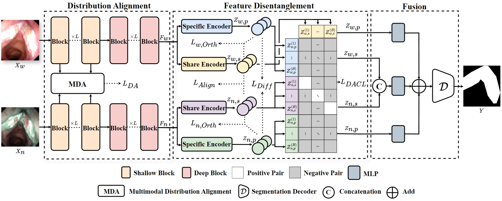

# Multimodal Medical Endoscopic Image Analysis via Progressive Disentangle-aware Contrastive Learning

## Abstract

Accurate segmentation of laryngo-pharyngeal tumors is crucial for precise diagnosis
and effective treatment planning. However, traditional single-modality imaging
methods often fall short of capturing the complex anatomical and pathological
features of these tumors. In this study, we present an innovative multi-modality
representation learning framework based on the Align--Disentangle--Fusion
mechanism that seamlessly integrates 2D White Light Imaging (WLI) and Narrow Band
Imaging (NBI) pairs to enhance segmentation performance. A cornerstone of our
approach is multi-scale distribution alignment, which mitigates modality
discrepancies by aligning features across multiple transformer layers.
Furthermore, a progressive feature disentanglement strategy is developed with
the designed preliminary disentanglement and disentangle-aware contrastive
learning to effectively separate modality-specific and shared features, enabling
robust multimodal contrastive learning and efficient semantic fusion.
Comprehensive experiments on multiple datasets demonstrate that our method
consistently outperforms state-of-the-art approaches, achieving superior accuracy
across diverse real clinical scenarios.

---

## Contributions



- We propose a **novel multimodal learning framework** for 2D medical image segmentation, which addresses cross-modal discrepancies through an **Align–Disentangle–Fusion** mechanism. Specifically, multi-scale distribution alignment is applied to low-level features to mitigate statistical mismatches, while high-level features are progressively disentangled into modality-shared and modality-specific components, enabling accurate and effective feature fusion.

- We develop a **disentangle-aware contrastive learning strategy** built upon the proposed framework. This strategy simultaneously enhances cross-modal alignment of shared representations and enforces clear separation between shared and modality-specific features, leading to more robust multimodal representation learning.

- We conduct **extensive experiments on three datasets**, where the proposed method consistently achieves **significant improvements over state-of-the-art approaches**, demonstrating its effectiveness and generalization capability.

---

## Installation

```bash
git clone https://github.com/wwwjh333/MM-EndoCL.git
cd MM-EndoCL

conda create -n MM-EndoCL python=3.9
conda activate MM-EndoCL

pip install -r requirements.txt
```
---

## Custom Dataset

If you would like to use a custom dataset, please place your data under the `./data` directory and prepare two CSV files, `Train.csv` and `Test.csv`, to specify the file paths of the training and testing samples, respectively.  
You may refer to the provided `demo_dataset` for an example of the expected data organization and CSV format.


---

## Training
```bash
python train.py --epochs 100 --batch_size 24 --dataset demo_dataset
```
The training dataset and corresponding class definitions should be specified in the `dataset_config` section of `train.py`.

---

## Inference
```bash
python test.py --dataset demo_dataset --batch_size 1 --weight_path xxx
```
The test dataset should be specified in the `dataset_config` section of `test.py`. Please also set `weight_path` to the path of the trained model weights before evaluation.

We provide example pretrained weights for testing and demonstration purposes, which can be downloaded from [[Google Drive](https://drive.google.com/file/d/1Sjq0fkLqaSIVAEmewsUCR1SjVFQesPgZ/view?usp=sharing)].


---